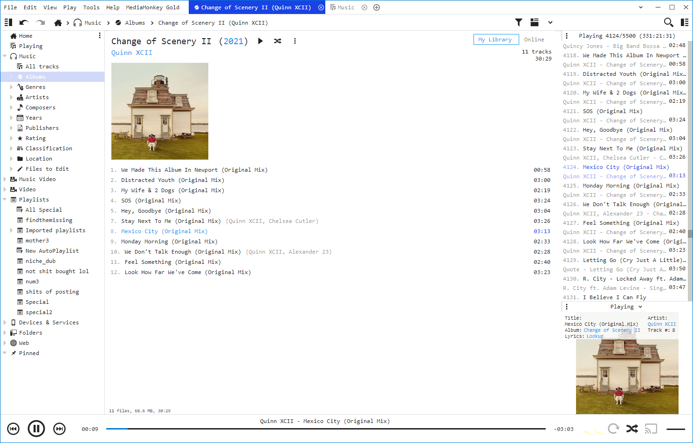

# WebSocket Now Playing for MediaMonkey
A way to show now playing via websockets in MediaMonkey 5.

## Installation
Download the latest release from the releases section and double click the downloaded mmip file. A MediaMonkey dialog will automatically pop up, prompting you to confirm the installation.
